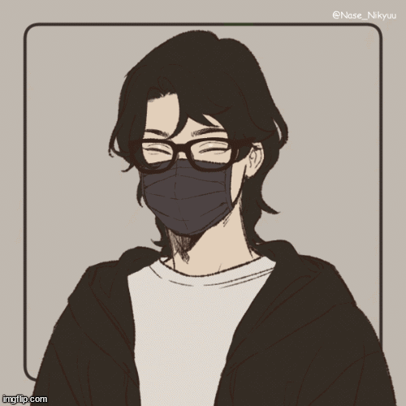

# Welcome to my profile! 👋

- Hi, my name is Alessandro Cruz
- I’m 23 years old
- Bachelor in Information Systems in Estácio Unimeta

---

 

  <a href="https://github.com/alessandrocruz01">
  
  
    

 
  
  
  
  
  
  
  
  

  
  
 

<!---
AlessandroCruz01/AlessandroCruz01 is a ✨ special ✨ repository because its `README.md` (this file) appears on your GitHub profile.
You can click the Preview link to take a look at your changes.
--->
